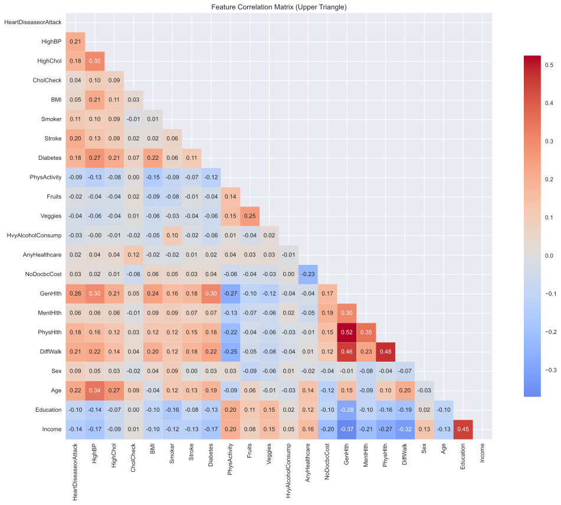
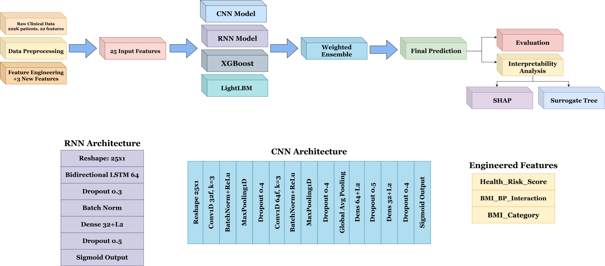
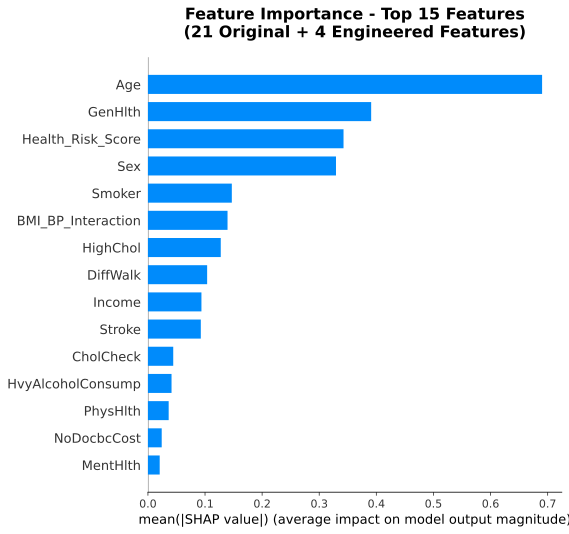
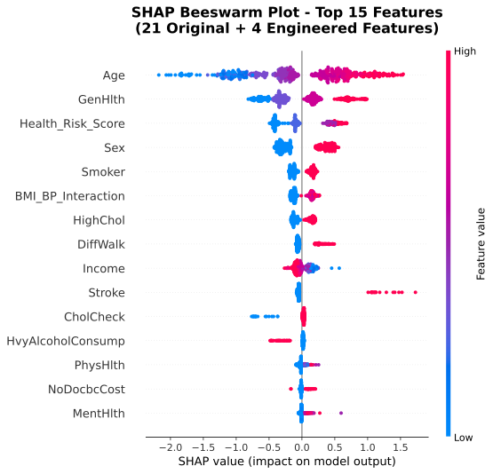
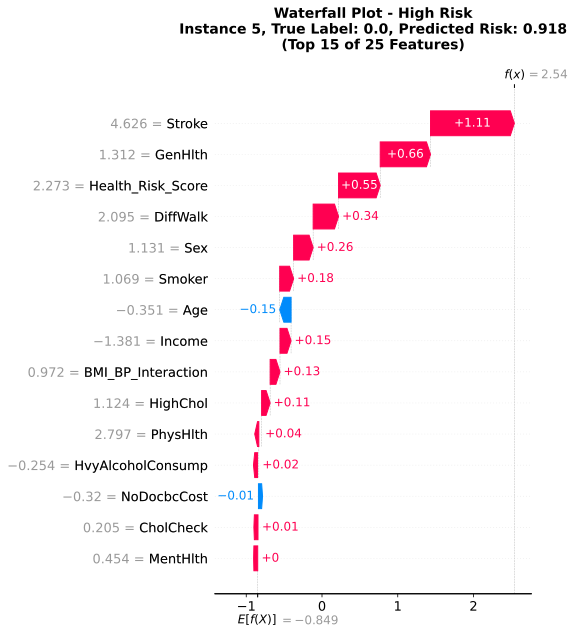
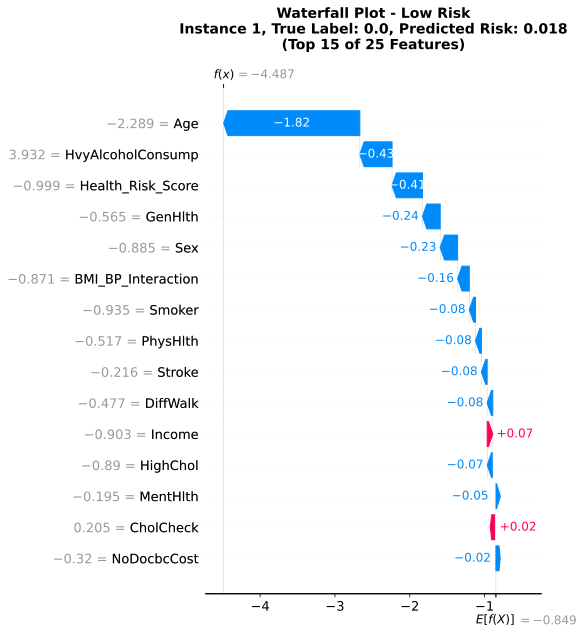

# Interpretable Heart Disease Prediction via a Weighted Ensemble Model

### A Large-Scale Study with SHAP and Surrogate Decision Trees for Clinically Transparent AI


---

## Overview

Cardiovascular disease (CVD) remains one of the leading causes of death worldwide. Machine learning offers a promising approach for identifying individuals at elevated risk, but two major challenges remain:

1. **Class imbalance** — positive cardiovascular disease cases represent a minority of the population.
2. **Black-box predictions** — high-performing machine learning models can be difficult for clinicians and other stakeholders to interpret.

This project addresses both challenges through a **weighted hybrid ensemble model** combining LightGBM, XGBoost, and a Convolutional Neural Network (CNN), while incorporating **SHAP-based explainability** and a **surrogate decision tree** to make the model's predictions more transparent.

The study uses **229,781 patient records** from the 2015 CDC Behavioral Risk Factor Surveillance System (BRFSS).

> **Goal:** Build a high-performing cardiovascular disease prediction system without sacrificing interpretability.

---

## Key Results

| Model                 |   Test AUC |    Recall | Precision |   F1 Score | Accuracy |
| --------------------- | ---------: | --------: | --------: | ---------: | -------: |
| **Weighted Ensemble** | **0.8371** | **80.0%** |     24.6% |     0.3757 |    72.6% |
| LightGBM              |     0.8368 |     62.5% |     31.6% | **0.4201** |    71.9% |
| XGBoost               |     0.8360 |         — |         — |          — |        — |
| CNN                   |     0.8260 |         — |         — |          — |        — |

The weighted ensemble achieved a test AUC of **0.8371**, slightly outperforming the LightGBM baseline (0.8368).

Bootstrap evaluation with **1,000 iterations** indicated that the improvement over LightGBM was statistically significant:

* **AUC improvement:** +0.0004
* **p-value:** 0.003

The ensemble also achieved substantially higher recall, making it particularly relevant to a **screening-oriented use case**, where identifying as many potentially high-risk individuals as possible is important.

---

## Dataset

The study uses the **2015 CDC BRFSS dataset**, containing:

* **229,781** patient records
* **22 original features**
* **25 features after feature engineering**
* Approximately **10.3% positive cardiovascular disease cases**
* Minority-to-majority ratio of approximately **1:8.7**
* **80/20 stratified train-test split**

The dataset was obtained through Kaggle from the CDC BRFSS survey.

### Feature Engineering

Three additional clinical features were constructed:

* `BMI_Category`
* `Health_Risk_Score`
* `BMI_BP_Interaction`

The `Health_Risk_Score` combines:

```text
HighBP + HighChol + Diabetes
```

This provides a compact representation of several major cardiovascular risk factors.

### Correlation Structure



*Upper-triangular correlation heatmap of clinical features, where red indicates strong positive correlation and blue represents weak or negative correlation among variables.*

---

## Methodology

The proposed architecture combines three complementary models:

### 1. LightGBM — 70%

A gradient boosting model optimized for structured/tabular clinical data.

### 2. XGBoost — 20%

A second gradient boosting model providing complementary decision boundaries and reducing dependence on a single tree-based learner.

### 3. CNN — 10%

A deep neural network designed to capture nonlinear feature interactions that may not be fully represented by the tree-based models.

The final prediction is produced through a weighted combination:

```text
Final Prediction =
0.70 × LightGBM
+ 0.20 × XGBoost
+ 0.10 × CNN
```

The ensemble weights were optimized using validation AUC.

### Training Pipeline

The overall workflow includes:

* Stratified train-test splitting
* Feature engineering
* Feature scaling using `StandardScaler`
* Class weighting to address imbalance
* Bayesian hyperparameter optimization
* Weighted ensemble construction
* Bootstrap evaluation with 1,000 iterations
* Threshold optimization
* SHAP-based global and local explanations
* Surrogate decision tree interpretation

No synthetic oversampling was used.

### Proposed Framework



*Workflow of the proposed hybrid ensemble framework integrating LightGBM, XGBoost, and deep neural networks (CNN) for clinical data prediction and interpretability analysis.*

---

## Model Performance

### ROC Curve Comparison


*Receiver operating characteristic (ROC) curve comparison of Ensemble, LightGBM, XGBoost, Random Forest, and CNN models.*

The ensemble provides the strongest overall discrimination, achieving a test AUC of **0.8371**.

### Ensemble Strategy Comparison


*Comparison of ensembling strategies and their corresponding validation AUCs.*

The results demonstrate that carefully weighting the component models provides better validation performance than relying on an individual learner or an arbitrary ensemble strategy.

### Clinical Metric Comparison


*Radar chart comparison of Ensemble and LightGBM models across five clinical metrics, illustrating the trade-off between recall and precision/F1 performance.*

The ensemble prioritizes recall, while LightGBM provides a better precision/F1 trade-off.

### Precision-Recall Analysis


*Precision-recall curves for all models, demonstrating the effect of changing the classification threshold on precision and recall.*

This highlights the importance of threshold selection in an imbalanced clinical prediction problem.

---

## Threshold Optimization

Different classification thresholds were selected for the models based on their desired operating characteristics:

| Model    | Classification Threshold |
| -------- | -----------------------: |
| Ensemble |                 **0.50** |
| LightGBM |                 **0.65** |
| XGBoost  |                 **0.65** |

For the ensemble, the default threshold of 0.50 provides a substantially higher recall of **80.0%**.

This reflects an important practical trade-off:

> In a screening context, missing a potentially high-risk patient can be more consequential than generating additional false positives.

The model should therefore be interpreted according to its intended application rather than evaluated solely on accuracy.

---

# Explainable AI

High predictive performance alone is insufficient for many healthcare applications. This project therefore uses **SHAP (SHapley Additive exPlanations)** to understand how individual features influence model predictions.

---

## Global Feature Importance



*SHAP feature importance showing mean absolute impact of each feature on model output.*

The most influential predictors include:

1. **Age**
2. **GenHlth**
3. **Health_Risk_Score**

These results provide insight into which clinical characteristics have the strongest influence on the model's predictions.

---

## SHAP Beeswarm Analysis



*SHAP beeswarm plot showing the distribution of SHAP values (effect on prediction) colored by feature value. Higher Age values (red) consistently push prediction toward higher risk.*

The beeswarm visualization illustrates both the magnitude and direction of feature effects across the dataset.

---

## Local Prediction Explanations

### High-Risk Prediction



*SHAP waterfall plot for a high-risk prediction (91.8% probability). History of Stroke was the dominant risk driver.*

This example demonstrates how the model combines multiple patient characteristics to arrive at a high-risk prediction, with **History of Stroke** acting as the dominant risk driver.

### Low-Risk Prediction



*SHAP waterfall plot for a low-risk prediction (1.8% probability). Youth (low Age) was the primary protective factor, overriding a concurrently high Health_Risk_Score.*

The local explanation demonstrates that a single strong protective characteristic can substantially alter the final prediction.

---

# Surrogate Decision Tree

While SHAP provides feature-level explanations, a simpler model can help communicate the broader decision-making structure.

A **pruned surrogate decision tree** was trained to replicate the behavior of the LightGBM model.


*Surrogate decision tree replicating the LightGBM model with 89.9% accuracy. The pruned tree (maximum depth 4) provides clear insight into the model's main decision pathways.*

The surrogate tree achieved **89.9% agreement** with the underlying model.

### Key Decision Pathways

The surrogate analysis highlights several important patterns:

* Younger individuals with healthier BMI-BP profiles and no history of stroke tend toward lower predicted risk.
* Older individuals, particularly males with elevated BMI-BP interaction values, tend toward higher predicted risk.
* History of stroke can act as a strong risk override.
* `BMI_BP_Interaction` emerges as an important decision node.

This provides a more intuitive representation of the complex relationships learned by the ensemble.

---

# Why This Model Matters

The project demonstrates that cardiovascular risk prediction does not necessarily have to choose between **performance** and **interpretability**.

The proposed framework combines:

**Predictive Modeling**

→ LightGBM
→ XGBoost
→ CNN
→ Weighted Ensemble

**Model Evaluation**

→ ROC-AUC
→ Precision
→ Recall
→ F1
→ Accuracy
→ Bootstrap significance testing

**Interpretability**

→ Global SHAP importance
→ SHAP beeswarm analysis
→ Local SHAP explanations
→ Surrogate decision tree

Together, these components create a more transparent machine learning pipeline for clinical risk prediction.

---

# Technical Skills Demonstrated

### Machine Learning

* Supervised learning
* Ensemble learning
* Gradient boosting
* Deep learning
* Classification
* Class imbalance handling
* Threshold optimization
* Bayesian hyperparameter optimization

### Healthcare AI

* Clinical risk prediction
* BRFSS data analysis
* Screening-oriented evaluation
* Recall/precision trade-off analysis

### Explainable AI

* SHAP
* Global feature importance
* Beeswarm plots
* Waterfall explanations
* Surrogate modeling
* Interpretable decision pathways

### Statistical Evaluation

* Bootstrap testing
* 1,000 bootstrap iterations
* Statistical significance testing
* Validation AUC comparison

### Tools & Technologies

* Python
* LightGBM
* XGBoost
* CNN / Deep Learning
* SHAP
* Scikit-learn
* Pandas
* NumPy
* Matplotlib

---

# Project Structure

```text
cvd-xai/
│
├── Figures/
│   ├── Pre-processing/
│   │   ├── correlation_matrix.svg
│   │   └── methodology_updated.svg
│   │
│   ├── Advanced Models/
│   │   ├── roc_curves.svg
│   │   ├── ensemble_strategies.svg
│   │   ├── metric_radar.svg
│   │   └── precision_recall_curves.svg
│   │
│   └── Explanations/
│       ├── Shap/
│       │   ├── feature_importance_correct.svg
│       │   ├── beeswarm_plot_correct.svg
│       │   ├── waterfall_high_risk_correct.svg
│       │   └── waterfall_low_risk_correct.svg
│       │
│       └── Surrogate Decision Tree/
│           └── compact_decision_tree.svg
│
├── notebooks/
├── scripts/
├── requirements.txt
└── README.md
```

---

# Reproducibility

Clone the repository and install the required dependencies:

```bash
git clone https://github.com/abrarhsnt/cvd-xai.git
cd cvd-xai

pip install -r requirements.txt
```

The repository contains the notebooks/scripts and supporting resources required to reproduce the analysis.

---

# Limitations

Despite promising results, several limitations should be considered:

* The dataset is based on survey data rather than direct clinical measurements.
* The positive cardiovascular disease class is substantially smaller than the negative class.
* The ensemble prioritizes recall at the cost of lower precision.
* The surrogate decision tree approximates the underlying model and should not be treated as an exact representation of its internal computations.
* The model has not been externally validated on an independent clinical cohort.
* The results should not be interpreted as evidence of clinical effectiveness.

Future work could investigate external validation, additional clinical datasets, calibration analysis, and more clinically focused threshold optimization.

---

# Applications

Potential applications include:

* Cardiovascular risk screening
* Population-level health risk analysis
* Clinical decision-support research
* Public health analytics
* Explainable healthcare AI research
* Risk stratification research

The system is intended primarily as a **research and educational framework**, rather than a production clinical diagnostic system.

---

# References

The project is based on research covering cardiovascular disease prediction, ensemble learning, gradient boosting, deep learning, SHAP-based interpretability, and surrogate modeling.

Key methodological foundations include:

* CDC Behavioral Risk Factor Surveillance System (BRFSS)
* LightGBM
* XGBoost
* SHAP
* Surrogate decision trees
* Bootstrap statistical evaluation
* Explainable artificial intelligence in healthcare


---

# Disclaimer

> **Research / Educational Use Only**
>
> This project is intended for research and educational purposes. It is **not a clinically validated diagnostic tool**, and its predictions should not be used to diagnose, treat, or make medical decisions about individual patients.

---

# Author

**Md Abrar Hasnat**

md.abrar.hasnat@g.bracu.ac.bd

---


